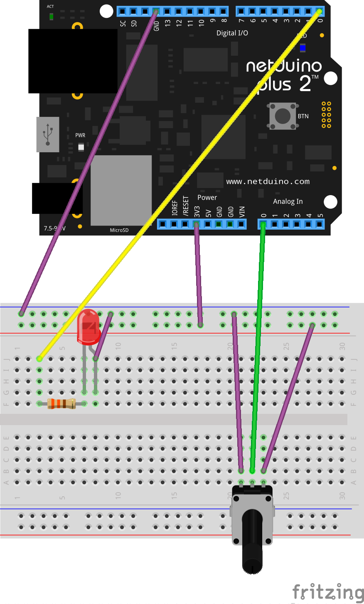

#SimpleAnalogPontentiometer

Demonstrates how to get the value from an analog input via a pontentiometer (aka: a rotary dial). The debug window outputs the volts that come from the pontentiometer & a data value returned in the rage of 0-4095 on the Netduino Plus 2.

*From Chapter 5 of [Getting Started with Netduino](http://www.amazon.com/Getting-Started-Netduino-Chris-Walker-ebook/dp/B007AU3D2U)*

