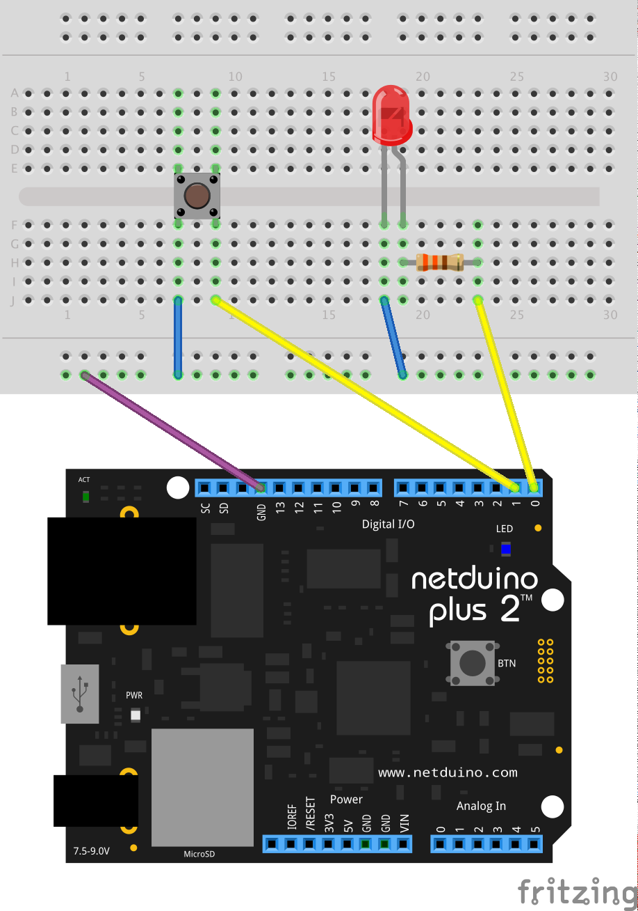

SimpleBroadboardButtonLed
=========================

First time using breadboard. Turns the LED on when the button is pressed. *From Chapter 5 of [Getting Started with Netduino](http://www.amazon.com/Getting-Started-Netduino-Chris-Walker-ebook/dp/B00DBIEYTG/ref=sr_1_1)*

